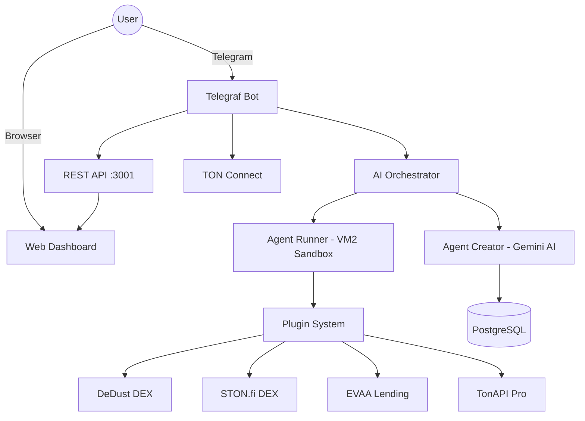

<div align="center">


# TON Agent Platform

**Autonomous AI agents for the TON blockchain — built in Telegram, no code required**

[](https://opensource.org/licenses/MIT)
[](https://nodejs.org)
[](https://www.typescriptlang.org)
[](https://t.me/TonAgentPlatformBot)
[](https://tonagentplatform.ru)

*Create, deploy and manage AI-powered agents that trade, monitor, and automate on TON — entirely through a Telegram conversation.*

[**🌐 Live Demo**](https://tonagentplatform.ru) · [**🤖 Try the Bot**](https://t.me/TonAgentPlatformBot) · [**📊 Dashboard**](https://tonagentplatform.ru/dashboard.html)

</div>

---

## What is this?

TON Agent Platform lets anyone create autonomous AI agents that run 24/7 on the TON blockchain — price monitors, DEX traders, wallet watchers, NFT snipers — without writing a single line of code. Users describe what they want in plain language; the platform generates, sandboxes, and deploys the agent instantly.

> "The Zapier for TON blockchain" — describe, deploy, automate.

---

## Quick Start

```bash
# 1. Clone and install
git clone https://github.com/spendollars/TonAgentPlatform
cd TonAgentPlatform && pnpm install

# 2. Configure
cp apps/builder-bot/.env.example apps/builder-bot/.env
# Edit .env: add BOT_TOKEN, OPENAI_API_KEY (Gemini or Anthropic)

# 3. Launch (Docker required)
docker compose -f infrastructure/docker-compose.prod.yml up -d
pnpm --filter builder-bot dev
```

Open Telegram → [@TonAgentPlatformBot](https://t.me/TonAgentPlatformBot) → `/start`

---

## Features

| | Feature | Description |
|---|---|---|
| 🧠 | **AI Code Generation** | Gemini/Claude generates agent code from natural language |
| 🔒 | **Sandboxed Execution** | Every agent runs in an isolated VM2 sandbox with resource limits |
| 📊 | **18 Agent Templates** | Ready-to-use templates for common TON automation tasks |
| 🔌 | **Plugin Ecosystem** | 12 plugins: DeDust, STON.fi, EVAA, TonAPI, CoinGecko, and more |
| ⏱️ | **Persistent Scheduling** | Agents run 24/7 with configurable intervals (5m, 15m, 1h, daily) |
| 💎 | **TON Connect** | Native wallet integration — sign transactions without leaving Telegram |
| 📈 | **Real-time Alerts** | Push notifications for price movements, wallet events, whale trades |
| 🌐 | **Web Dashboard** | Monitor all agents at [tonagentplatform.ru/dashboard.html](https://tonagentplatform.ru/dashboard.html) |

---

## Architecture



---

## Plugin Library

| Plugin | Type | Description | Status |
|--------|------|-------------|--------|
| 💧 **DeDust DEX** | DeFi | Swaps, liquidity pools, price feeds via DeDust API | ✅ Ready |
| 🌊 **STON.fi DEX** | DeFi | AMM swaps, pool analytics via STON.fi API | ✅ Ready |
| 🏦 **EVAA Lending** | DeFi | Lending/borrowing positions on EVAA Protocol | ✅ Ready |
| 🔍 **TonAPI Pro** | Data | Wallet data, NFTs, transactions via TonAPI | ✅ Ready |
| 📊 **CoinGecko Price Feed** | Data | Real-time & historical crypto prices | ✅ Ready |
| 🐋 **Whale Tracker** | Analytics | Monitor large wallet movements on TON | ✅ Ready |
| 📡 **TON Stat Analytics** | Analytics | Network stats, DEX volume, chain metrics | ✅ Ready |
| 📱 **Discord Webhook** | Notification | Discord channel notifications | ✅ Ready |
| 📧 **Email Notifier** | Notification | SMTP email alerts | ✅ Ready |
| 💬 **Slack Notifier** | Notification | Slack workspace notifications | ✅ Ready |
| 🛡️ **Drain Detector** | Security | AI-powered wallet drain detection | ✅ Ready |
| 🔬 **Contract Auditor** | Security | Smart contract risk analysis | ✅ Ready |

---

## Agent Templates (18)

**DeFi & Trading**
- `ton-price-monitor` — Alert when TON price crosses a threshold
- `arbitrage-scanner` — Find price gaps across DeDust / STON.fi
- `dex-swap-monitor` — Track DEX swaps in real time
- `crypto-portfolio` — Multi-coin portfolio tracker with P&L
- `price_alert_v2` — Advanced price alerts with multiple conditions

**Wallet & Balance**
- `ton-balance-checker` — Check TON wallet balance on demand
- `low-balance-alert` — Alert when wallet drops below threshold
- `balance_monitor_v2` — Advanced multi-wallet monitoring
- `jetton-balance-checker` — Track Jetton (TRC-20) token balances

**NFT**
- `nft-floor-monitor` — Watch NFT collection floor prices hourly

**Automation & Reports**
- `daily-ton-report` — Daily portfolio summary delivered at set time
- `payroll-agent` — Scheduled TON payments to multiple wallets
- `website-monitor` — HTTP uptime & status code monitor
- `weather-notifier` — Weather alerts for any city

**Webhooks & Integration**
- `webhook-receiver` — React to external HTTP webhook events
- `webhook-sender` — Send data to external URLs on trigger
- `telegram-notifier` — Forward alerts to any Telegram chat

**Multi-Agent**
- `multi_agent_orchestrator` — Coordinate multiple agents in parallel

---

## API

All authenticated endpoints require `X-Auth-Token` header.

### Public
```
GET  /api/config                   → bot username, landing URL
GET  /api/stats                    → global stats (activeAgents, totalUsers, agentsCreated)
GET  /api/auth/request             → start Telegram deeplink auth, returns authToken + botLink
GET  /api/auth/check/:token        → poll auth status → {status: 'pending'|'approved', token}
POST /api/auth/telegram            → Telegram Login Widget callback (HMAC-SHA256 verified)
GET  /tonconnect-manifest.json     → TON Connect manifest
```

### Authenticated (X-Auth-Token required)
```
GET  /api/me                       → current user info
GET  /api/stats/me                 → personal stats: agentsActive, totalRuns, successRate, uptimeSeconds
GET  /api/agents                   → list user agents
GET  /api/agents/:id               → single agent detail
POST /api/agents/:id/run           → start agent
POST /api/agents/:id/stop          → stop/pause agent
GET  /api/agents/:id/logs?limit=   → DB-persisted execution logs
GET  /api/agents/:id/history?limit=→ execution history (started_at, duration_ms, status)
GET  /api/activity?limit=          → all agent logs for current user (activity stream)
GET  /api/executions?status=       → execution history with filter: all|running|success|error
GET  /api/plugins                  → plugin list (isInstalled reflects per-user state)
POST /api/plugins/:id/install      → install plugin for user (body: {config})
DELETE /api/plugins/:id            → uninstall plugin for user
GET  /api/settings                 → all user settings as {key: value} map
POST /api/settings                 → save settings (body: {key,value} or {settings:{...}})
GET  /api/connectors               → connected external services
POST /api/connectors/:service      → add/update connector (body: {config:{...}})
DELETE /api/connectors/:service    → remove connector
```

---

## Security

- **Sandboxed execution** — VM2 with restricted globals; no `fs`, `child_process`, `net` access
- **Resource limits** — 30s max execution time, memory cap per agent
- **AI security scanner** — Static analysis before every agent deployment
- **Rate limiting** — Per-user API rate limits on all endpoints
- **Auth** — Telegram OAuth + deeplink auth; no passwords stored

---

## Tech Stack

| Layer | Technology |
|-------|-----------|
| Bot framework | Telegraf v4 |
| Language | TypeScript 5.x |
| AI backend | Gemini 2.5 Flash (OpenAI-compatible) |
| Database | PostgreSQL 15 + Drizzle ORM |
| Sandbox | VM2 (isolated Node.js) |
| TON | @ton/core, @tonconnect/sdk |
| Infrastructure | Docker Compose + nginx + PM2 |
| SSL | Let's Encrypt |

---

## Contributing

### Adding a Plugin

1. Open `apps/builder-bot/src/plugins-system.ts`
2. Implement the `Plugin` interface with a `skillDoc` (AI uses this to generate agent code)
3. Add your `configSchema` (shown to users in Telegram)
4. Submit a PR

```typescript
interface Plugin {
  id: string;
  name: string;
  type: PluginType;
  skillDoc: string;        // Markdown docs for AI code generation
  configSchema: Schema[];  // Config fields shown in Telegram UI
  execute: (params) => Promise<any>;
}
```

---

## Roadmap

- [x] AI agent code generation (Gemini 2.5 Flash)
- [x] VM2 sandboxed execution
- [x] PostgreSQL persistence + Drizzle ORM
- [x] TON Connect wallet integration
- [x] Plugin ecosystem (12 plugins)
- [x] 18 agent templates
- [x] Web dashboard with Telegram auth
- [x] Persistent 24/7 agent scheduling
- [x] Production deployment (tonagentplatform.ru, HTTPS)
- [x] Fast Demo flow with deep links
- [x] DB-persisted agent state (write-through cache, survives restarts)
- [x] Execution history & activity stream (agent_logs, execution_history tables)
- [x] Per-user plugin install/uninstall (user_plugins table)
- [x] User settings & connectors API (user_settings table)
- [x] Real `/api/stats` from DB (activeAgents, totalUsers, agentsCreated)
- [x] Real `execute()` for CoinGecko, DeDust, Whale Tracker, Discord Notifier plugins
- [ ] Prometheus + Grafana monitoring
- [ ] Agent marketplace (community-published agents)
- [ ] Telegram Mini App (mobile-optimized)
- [ ] On-chain agent registry (TON smart contract)
- [ ] Multi-chain support (ETH, SOL)

---

## License

MIT © 2026 TON Agent Platform

---

<div align="center">

Built for the TON ecosystem · [tonagentplatform.ru](https://tonagentplatform.ru) · [@TonAgentPlatformBot](https://t.me/TonAgentPlatformBot)

</div>
