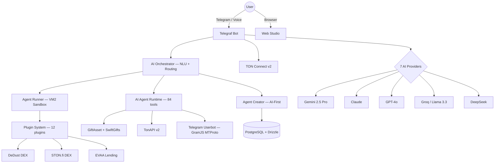

<div align="center">


# TON Agent Platform

**Autonomous AI agents for the TON blockchain — built in Telegram, no code required**

[](https://identityhub.app/contests/ai-hackathon?submission=cmmnwv6sg001b01oboxo8f57r)
[](https://identityhub.app/contests/agent-tooling-fast-grants?submission=cmlz5smqj000101p7wao32nfd)

[](https://opensource.org/licenses/MIT)
[](https://nodejs.org)
[](https://www.typescriptlang.org)
[](https://www.postgresql.org)
[](https://t.me/TonAgentPlatformBot)
[](https://tonagentplatform.com)

<br>

*Describe what you want in plain text or voice — the platform generates, sandboxes, and deploys an autonomous AI agent instantly.*

<br>

[**Try the Bot**](https://t.me/TonAgentPlatformBot) &nbsp;·&nbsp; [**Studio Dashboard**](https://tonagentplatform.com/dashboard.html) &nbsp;·&nbsp; [**Telegram Channel**](https://t.me/TONAgentPlatform)

</div>

<br>

## What is this?

TON Agent Platform lets anyone create **autonomous AI agents** that operate as real Telegram users on the TON blockchain — price monitors, gift arbitrage bots, DEX traders, wallet watchers, NFT snipers — **without writing a single line of code**.

Describe what you want in text or voice. The AI generates a system prompt, picks the right tools from 84 available, and deploys the agent in seconds. The agent gets its own TON wallet and Telegram account and runs 24/7.

> **Built by two young developers. Previous TON grant winner.**

<br>

## Key Features

<table>
<tr>
<td width="50%">

### 🤖 AI-First Agent Creation
Describe a task in text or voice → AI generates system prompt + picks tools → agent runs autonomously

### 🧠 7 AI Providers
Gemini 2.5 Pro, GPT-4o, Claude, Groq, DeepSeek, OpenRouter, Together — switch per agent or use platform fallback

### 🎤 Voice Commands
Send a voice message → transcription → agent created or command executed

### 🔧 84 Agent Tools
TON balance, NFT floors, gift arbitrage, web search, HTTP fetch, Telegram userbot, state management, notifications

</td>
<td width="50%">

### 💎 Gift Marketplace Integration
Real-time pricing via GiftAsset + SwiftGifts APIs, arbitrage scanning, portfolio tracking, automated buy/sell

### 📱 Telegram Userbot (MTProto)
Agents operate as real Telegram users — read chats, send messages, react, join channels, search, forward

### 🏗 Visual Workflow Constructor
Build agent logic visually without code — connect blocks, set triggers, define conditions

### 🖥 Studio Dashboard
Web interface for managing agents, API keys, Telegram auth (QR login), logs, and execution history

</td>
</tr>
</table>

<br>

## Architecture


```mermaid
graph TB
    User((User)) -->|Telegram / Voice| Bot[Telegraf Bot]
    User -->|Browser| Studio[Web Studio]
    Bot --> Orchestrator[AI Orchestrator — NLU + Routing]
    Orchestrator --> Creator[Agent Creator — AI-First]
    Orchestrator --> AIRuntime[AI Agent Runtime — 84 tools]
    Orchestrator --> Runner[Agent Runner — VM2 Sandbox]
    Runner --> Plugins[Plugin System — 12 plugins]
    AIRuntime --> GiftAsset[GiftAsset + SwiftGifts]
    AIRuntime --> TonAPI[TonAPI v2]
    AIRuntime --> Userbot[Telegram Userbot — GramJS MTProto]
    Plugins --> DeDust[DeDust DEX]
    Plugins --> STON[STON.fi DEX]
    Plugins --> EVAA[EVAA Lending]
    Creator --> DB[(PostgreSQL + Drizzle)]
    Bot --> TonConnect[TON Connect v2]
    Bot --> MultiProvider{7 AI Providers}
    MultiProvider --> Gemini[Gemini 2.5 Pro]
    MultiProvider --> Claude[Claude]
    MultiProvider --> GPT[GPT-4o]
    MultiProvider --> Groq[Groq / Llama 3.3]
    MultiProvider --> DeepSeek[DeepSeek]
```

<br>

## Agent Tools (84)

Agents autonomously choose which tools to call via function calling:

| Category | Tools | Count |
|----------|-------|-------|
| **TON Blockchain** | `get_ton_balance`, `send_ton`, `get_agent_wallet`, `get_nft_floor` | 4 |
| **Gift Marketplace** | `get_gift_catalog`, `get_gift_floor_real`, `scan_real_arbitrage`, `buy_catalog_gift`, `buy_resale_gift`, `list_gift_for_sale`, `appraise_gift`, `get_price_list`, `get_market_overview`, `get_gift_sales_history`, `get_top_deals`, `get_market_health`, `get_collections_marketcap`, `get_gift_aggregator`, `get_user_portfolio` | 15 |
| **DeFi** | `dex_get_prices`, `dex_swap_simulate`, `dex_get_pool_info`, `dex_get_routes` | 4 |
| **Telegram Userbot** | `tg_send_message`, `tg_get_messages`, `tg_join_channel`, `tg_search_messages`, `tg_forward`, `tg_react`, `tg_get_channel_info`, `tg_set_typing`, `tg_pin_message`, `tg_delete_message` + 10 more | 20 |
| **Web & Search** | `web_search`, `fetch_url`, `http_fetch` | 3 |
| **State & Notifications** | `get_state`, `set_state`, `notify`, `notify_rich` | 4 |
| **Agent Coordination** | `list_my_agents`, `ask_agent`, `list_plugins`, `run_plugin` | 4 |
| **NFT Analytics** | `get_nft_collection`, `get_nft_items`, `get_nft_history` | 3 |
| **Scheduling & System** | `set_timer`, `cancel_timer`, `get_time`, `sleep` | 4 |
| **+ Plugins** | 12 plugins with their own tool sets | ~23 |

<br>

## Plugin Library

| Plugin | Type | Description |
|--------|------|-------------|
| 💱 **DeDust DEX** | DeFi | Swaps, liquidity pools, price feeds |
| 💱 **STON.fi DEX** | DeFi | AMM swaps, pool analytics |
| 🏦 **EVAA Lending** | DeFi | Lending/borrowing on EVAA Protocol |
| 📊 **TonAPI Pro** | Data | Wallet data, NFTs, transactions |
| 📈 **CoinGecko** | Data | Real-time & historical crypto prices |
| 🐋 **Whale Tracker** | Analytics | Large wallet movement monitoring |
| 📉 **TON Stat** | Analytics | Network stats, DEX volume, chain metrics |
| 🔔 **Discord** | Notification | Discord channel notifications |
| 📧 **Email** | Notification | SMTP email alerts |
| 💬 **Slack** | Notification | Slack workspace notifications |
| 🛡 **Drain Detector** | Security | AI-powered wallet drain detection |
| 🔍 **Contract Auditor** | Security | Smart contract risk analysis |

<br>

## Agent Templates (22)

| Category | Templates |
|----------|-----------|
| **DeFi & Trading** | `ton-price-monitor`, `arbitrage-scanner`, `dex-swap-monitor`, `crypto-portfolio`, `price-alert-v2` |
| **Wallet** | `ton-balance-checker`, `low-balance-alert`, `balance-monitor-v2`, `jetton-balance-checker` |
| **NFT** | `nft-floor-monitor`, `nft-arbitrage-v2`, `nft-floor-predictor` |
| **Gifts** | `telegram-gift-monitor`, `unified-arbitrage-ai` |
| **Automation** | `daily-ton-report`, `payroll-agent`, `website-monitor`, `weather-notifier` |
| **Webhooks** | `webhook-receiver`, `webhook-sender`, `telegram-notifier` |
| **Multi-Agent** | `multi-agent-orchestrator`, `super-agent` |

<br>

## Quick Start

```bash
# 1. Clone and install
git clone https://github.com/spendollars/TonAgentPlatform
cd TonAgentPlatform && pnpm install

# 2. Configure
cp apps/builder-bot/.env.example apps/builder-bot/.env
# Edit .env: add BOT_TOKEN, DB credentials, optionally AI API keys

# 3. Launch
docker compose -f infrastructure/docker-compose.prod.yml up -d   # PostgreSQL
pnpm --filter builder-bot dev
```

Open Telegram → [@TonAgentPlatformBot](https://t.me/TonAgentPlatformBot) → `/start`

<br>

## Tech Stack

| Layer | Technology |
|-------|-----------|
| **Bot** | Telegraf v4 |
| **Language** | TypeScript 5.x |
| **AI** | 7 providers: Gemini 2.5 Pro, Claude, GPT-4o, Groq, DeepSeek, OpenRouter, Together |
| **Database** | PostgreSQL 15 + Drizzle ORM |
| **Sandbox** | VM2 (isolated execution, SSRF protection) |
| **Runtime** | Autonomous agentic loop (function calling, up to 5 iterations) |
| **TON** | @ton/core, @ton/ton, @ton/crypto, @tonconnect/sdk |
| **Telegram** | GramJS MTProto (userbot) + Telegraf (bot) |
| **Gifts** | GiftAsset + SwiftGifts (rate-limited, cached) |
| **Infra** | Docker Compose + nginx + PM2 + Let's Encrypt |

<br>

## Security

- **Sandboxed execution** — VM2 with restricted globals; no `fs`, `child_process`, `net`
- **SSRF protection** — blocks localhost, private IPs, metadata endpoints, dangerous protocols
- **Resource limits** — 30s max execution, memory cap per agent
- **AI security scanner** — static analysis before deployment
- **Rate limiting** — per-user API rate limits
- **CORS hardening** — strict origin allowlist
- **Ownership verification** — all API endpoints verify resource ownership
- **Auth** — Telegram OAuth + deeplink + QR login; no passwords stored

<br>

## Roadmap

- [x] AI-first agent creation (text + voice → AI builds agent)
- [x] 7 AI providers with fallback chain + per-agent switching
- [x] 80+ agent tools (TON, gifts, NFT, DeFi, web, Telegram, Discord, X/Twitter)
- [x] Multi-platform support: Telegram, Discord, X/Twitter
- [x] GiftAsset API + real-time WebSocket price stream
- [x] Telegram userbot (MTProto) — agents as real users
- [x] Shared Session Router — multi-agent on one TG account
- [x] Pre-transaction security scans + address blacklist
- [x] Approval workflows for dangerous operations
- [x] Audit trail + p95/p99 metrics
- [x] AI-based capability detection (no hardcoded keywords)
- [x] Skill trees — auto-learning knowledge base per agent
- [x] Visual workflow constructor + Studio dashboard
- [x] 20 configurable capabilities per agent
- [x] VM2 sandboxed execution with SSRF protection
- [x] TON Connect v2 wallet integration
- [x] 12 plugins + 22 templates + agent marketplace
- [x] Voice commands + speech recognition
- [x] Image generation (fal.ai)
- [x] Blockchain analytics (Dune)
- [ ] Telegram Mini App
- [ ] On-chain agent registry (TON smart contract)
- [ ] DAO governance + platform token

<br>

## License

MIT (c) 2026 TON Agent Platform

---

<div align="center">

**Built for the TON ecosystem**

[tonagentplatform.com](https://tonagentplatform.com) &nbsp;·&nbsp; [@TonAgentPlatformBot](https://t.me/TonAgentPlatformBot) &nbsp;·&nbsp; [Telegram Channel](https://t.me/TONAgentPlatform)

</div>
