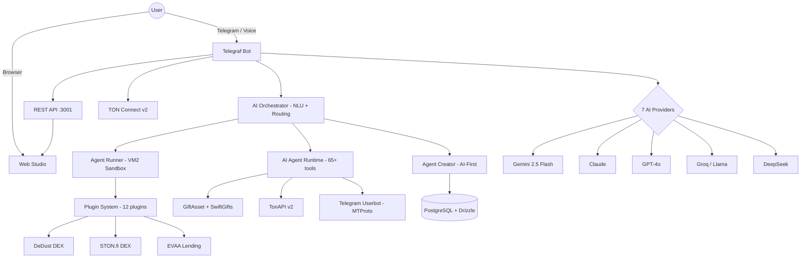

<div align="center">


# TON Agent Platform

**Autonomous AI agents for the TON blockchain — built in Telegram, no code required**


[](https://opensource.org/licenses/MIT)
[](https://nodejs.org)
[](https://www.typescriptlang.org)
[](https://t.me/TonAgentPlatformBot)
[](https://tonagentplatform.com)

*Describe what you want in plain text or voice — the platform generates, sandboxes, and deploys an autonomous AI agent instantly.*

[**Live Demo**](https://tonagentplatform.com) · [**Try the Bot**](https://t.me/TonAgentPlatformBot) · [**Studio**](https://tonagentplatform.com/studio)

</div>

---

## What is this?

TON Agent Platform lets anyone create autonomous AI agents that run 24/7 on the TON blockchain — price monitors, gift arbitrage bots, DEX traders, wallet watchers, NFT snipers — without writing a single line of code. Describe what you want in text or voice; the AI generates a system prompt, picks the right tools, and deploys the agent in seconds.

> AI-first: you describe the task, AI builds the agent. 7 providers, 65+ tools, 12 plugins, voice commands.

---

## Quick Start

```bash
# 1. Clone and install
git clone https://github.com/spendollars/TonAgentPlatform
cd TonAgentPlatform && pnpm install

# 2. Configure
cp apps/builder-bot/.env.example apps/builder-bot/.env
# Edit .env: add BOT_TOKEN, DB credentials, optionally AI API keys

# 3. Launch
docker compose -f infrastructure/docker-compose.prod.yml up -d   # PostgreSQL
pnpm --filter builder-bot dev
```

Open Telegram -> [@TonAgentPlatformBot](https://t.me/TonAgentPlatformBot) -> `/start`

---

## Key Features

| | Feature | Description |
|---|---|---|
| **AI** | **AI-First Agent Creation** | Describe a task in text or voice -> AI generates system prompt + picks tools -> agent runs autonomously |
| **AI** | **7 AI Providers** | Gemini, OpenAI, Anthropic, Groq, DeepSeek, OpenRouter, Together — switch per agent |
| **AI** | **Platform Proxy Fallback** | Agents work even without a user API key (platform provides AI) |
| **Voice** | **Voice Commands** | Send a voice message -> transcription -> agent created or command executed |
| **Tools** | **65+ Agent Tools** | TON balance, NFT floors, gift arbitrage, web search, HTTP fetch, Telegram userbot, state management, notifications |
| **Gifts** | **Gift Arbitrage** | Real-time gift pricing via GiftAsset + SwiftGifts APIs, automated buy/sell, market analysis |
| **Sandbox** | **Sandboxed Execution** | Every agent runs in an isolated VM2 sandbox with SSRF protection + resource limits |
| **Plugins** | **12 Plugins** | DeDust, STON.fi, EVAA, TonAPI, CoinGecko, Whale Tracker, Discord, Slack, Email, and more |
| **Templates** | **22 Agent Templates** | Ready-to-use templates for common TON automation tasks |
| **Schedule** | **Persistent Scheduling** | Agents run 24/7 with configurable intervals (1m to daily), survive restarts |
| **Wallet** | **TON Connect** | Native wallet integration — sign transactions without leaving Telegram |
| **Alerts** | **Rich Notifications** | HTML-formatted push alerts with inline buttons, per-agent customization |
| **Marketplace** | **Agent Marketplace** | Publish, buy, and sell agents — community-driven template economy |
| **Studio** | **Web Studio** | Monitor agents, view logs, manage plugins, wallet balance at [tonagentplatform.com/dashboard](https://tonagentplatform.com/studio) |
| **Userbot** | **Telegram Userbot** | Agents can read/send/forward messages, join channels, search — full Telegram automation via MTProto |
| **Multi** | **Inter-Agent Communication** | Agents can message each other, coordinate tasks, share data |
| **Self** | **Self-Improvement** | Platform AI periodically proposes code improvements to agents |

---

## Screenshots

<!-- Add screenshots here -->
| Agent Creation | Studio | Marketplace |
|:-:|:-:|:-:|
| *Coming soon* | *Coming soon* | *Coming soon* |

---

## Architecture

> Full details: [docs/ARCHITECTURE.md](docs/ARCHITECTURE.md) | API reference: [docs/API.md](docs/API.md)


```mermaid
graph TB
    User((User)) -->|Telegram / Voice| Bot[Telegraf Bot]
    User -->|Browser| Studio[Web Studio]
    Bot --> Orchestrator[AI Orchestrator - NLU + Routing]
    Bot --> APIServer[REST API :3001]
    Orchestrator --> Creator[Agent Creator - AI-First]
    Orchestrator --> AIRuntime[AI Agent Runtime - 65+ tools]
    Orchestrator --> Runner[Agent Runner - VM2 Sandbox]
    Runner --> Plugins[Plugin System - 12 plugins]
    AIRuntime --> GiftAsset[GiftAsset + SwiftGifts]
    AIRuntime --> TonAPI[TonAPI v2]
    AIRuntime --> Userbot[Telegram Userbot - MTProto]
    Plugins --> DeDust[DeDust DEX]
    Plugins --> STON[STON.fi DEX]
    Plugins --> EVAA[EVAA Lending]
    Creator --> DB[(PostgreSQL + Drizzle)]
    APIServer --> Studio
    Bot --> TonConnect[TON Connect v2]
    Bot --> MultiProvider{7 AI Providers}
    MultiProvider --> Gemini[Gemini 2.5 Flash]
    MultiProvider --> Claude[Claude]
    MultiProvider --> GPT[GPT-4o]
    MultiProvider --> Groq[Groq / Llama]
    MultiProvider --> DeepSeek[DeepSeek]
```

---

## AI Agent Tools (65+)

Agents autonomously choose which tools to call based on their system prompt:

**TON Blockchain**: `get_ton_balance`, `get_nft_floor`, `send_ton`, `get_agent_wallet`

**Gift Arbitrage**: `get_gift_catalog`, `get_gift_floor_real`, `scan_real_arbitrage`, `buy_catalog_gift`, `buy_resale_gift`, `list_gift_for_sale`, `appraise_gift`, `get_price_list`, `get_market_overview`, `get_gift_sales_history`, `get_top_deals`, `get_market_health`, `get_collections_marketcap`, `get_gift_aggregator`

**Web & Search**: `web_search` (DuckDuckGo), `fetch_url`, `http_fetch`

**Telegram Userbot** (20 tools): `tg_send_message`, `tg_get_messages`, `tg_join_channel`, `tg_search_messages`, `tg_forward`, `tg_react`, and more

**State & Notifications**: `get_state`, `set_state`, `notify`, `notify_rich` (HTML + buttons)

**Agent Coordination**: `list_my_agents`, `ask_agent`, `list_plugins`, `run_plugin`

---

## Plugin Library

| Plugin | Type | Description | Status |
|--------|------|-------------|--------|
| **DeDust DEX** | DeFi | Swaps, liquidity pools, price feeds | Ready |
| **STON.fi DEX** | DeFi | AMM swaps, pool analytics | Ready |
| **EVAA Lending** | DeFi | Lending/borrowing on EVAA Protocol | Ready |
| **TonAPI Pro** | Data | Wallet data, NFTs, transactions | Ready |
| **CoinGecko Price Feed** | Data | Real-time & historical crypto prices | Ready |
| **Whale Tracker** | Analytics | Large wallet movement monitoring | Ready |
| **TON Stat Analytics** | Analytics | Network stats, DEX volume, chain metrics | Ready |
| **Discord Webhook** | Notification | Discord channel notifications | Ready |
| **Email Notifier** | Notification | SMTP email alerts | Ready |
| **Slack Notifier** | Notification | Slack workspace notifications | Ready |
| **Drain Detector** | Security | AI-powered wallet drain detection | Ready |
| **Contract Auditor** | Security | Smart contract risk analysis | Ready |

---

## Agent Templates (22)

**DeFi & Trading**: `ton-price-monitor`, `arbitrage-scanner`, `dex-swap-monitor`, `crypto-portfolio`, `price-alert-v2`

**Wallet & Balance**: `ton-balance-checker`, `low-balance-alert`, `balance-monitor-v2`, `jetton-balance-checker`

**NFT**: `nft-floor-monitor`, `nft-arbitrage-v2`, `nft-floor-predictor`

**Gift Arbitrage**: `telegram-gift-monitor`, `unified-arbitrage-ai` (AI-powered, GiftAsset + SwiftGifts)

**Automation & Reports**: `daily-ton-report`, `payroll-agent`, `website-monitor`, `weather-notifier`

**Webhooks & Integration**: `webhook-receiver`, `webhook-sender`, `telegram-notifier`

**Multi-Agent**: `multi-agent-orchestrator`, `super-agent` (hybrid)

---

## API (42 endpoints)

All authenticated endpoints require `X-Auth-Token` header.

### Public
```
GET  /api/config                        Platform config
GET  /api/stats                         Global stats (agents, users, created)
GET  /api/auth/request                  Start Telegram deeplink auth
GET  /api/auth/check/:token             Poll auth status
POST /api/auth/telegram                 Telegram Login Widget (HMAC-SHA256)
GET  /api/tonconnect-manifest.json      TON Connect manifest
GET  /api/platform/health               Health check
```

### Authenticated
```
GET    /api/me                          Current user
GET    /api/stats/me                    Personal stats
GET    /api/agents                      List agents
GET    /api/agents/:id                  Agent detail
POST   /api/agents/:id/run              Start agent
POST   /api/agents/:id/stop             Stop agent
DELETE /api/agents/:id                  Delete agent
POST   /api/agents/:id/rename           Rename agent
GET    /api/agents/:id/logs             Execution logs
GET    /api/agents/:id/history          Execution history
GET    /api/activity                    Activity stream
GET    /api/executions                  Executions with filters
GET    /api/plugins                     Plugin list
POST   /api/plugins/:id/install         Install plugin
DELETE /api/plugins/:id                 Uninstall plugin
GET    /api/settings                    User settings
POST   /api/settings                    Save settings
GET    /api/connectors                  External services
POST   /api/connectors/:service         Connect service
DELETE /api/connectors/:service         Disconnect service
GET    /api/marketplace                 Browse marketplace
GET    /api/marketplace/my              User listings
GET    /api/marketplace/purchases       Purchases
POST   /api/marketplace                 Publish agent
DELETE /api/marketplace/:id             Remove listing
GET    /api/proposals                   AI improvement proposals
POST   /api/proposals/:id/approve       Approve proposal
POST   /api/proposals/:id/reject        Reject proposal
POST   /api/proposals/:id/rollback      Rollback proposal
GET    /api/balance                     Wallet balance
GET    /api/transactions                Transaction history
POST   /api/topup/check                 Verify topup
POST   /api/withdraw                    Withdraw TON
POST   /api/emergency-stop              Emergency stop all agents
```

---

## Security

- **Sandboxed execution** — VM2 with restricted globals; no `fs`, `child_process`, `net`
- **SSRF protection** — blocks localhost, private IPs (10.x, 172.16.x, 192.168.x), IPv6 (::1, fc/fd/fe80), metadata endpoints (169.254.x), dangerous protocols (file:, ftp:)
- **Resource limits** — 30s max execution, memory cap per agent
- **AI security scanner** — static analysis before deployment
- **Rate limiting** — per-user API rate limits
- **CORS hardening** — strict origin allowlist, no wildcard
- **Ownership verification** — all API endpoints verify user owns the resource
- **Fetch timeouts** — 10s AbortSignal on all external HTTP calls
- **GraphQL injection protection** — parameterized queries with input sanitization
- **Memory leak prevention** — periodic cleanup of pending state Maps (30-min TTL)
- **Auth** — Telegram OAuth + deeplink auth; no passwords stored

---

## Tech Stack

| Layer | Technology |
|-------|-----------|
| Bot framework | Telegraf v4 |
| Language | TypeScript 5.x |
| AI backend | 7 providers: Gemini 2.5 Flash, Claude, GPT-4o, Groq, DeepSeek, OpenRouter, Together |
| Database | PostgreSQL 15 + Drizzle ORM |
| Agent sandbox | VM2 (isolated Node.js) |
| AI agent runtime | Autonomous agentic loop (up to 5 tool calls per tick) |
| TON | @ton/core, @ton/ton, @ton/crypto, @tonconnect/sdk |
| Telegram | GramJS MTProto (userbot), Telegraf (bot) |
| Gift APIs | GiftAsset + SwiftGifts (rate-limited, cached) |
| Infrastructure | Docker Compose + nginx + PM2 |
| SSL | Let's Encrypt |

---

## Contributing

> Full guide: [CONTRIBUTING.md](CONTRIBUTING.md)

### Adding a Plugin

1. Open `apps/builder-bot/src/plugins-system.ts`
2. Implement the `Plugin` interface with a `skillDoc` (AI uses this to generate agent code)
3. Add your `configSchema` (shown to users in Telegram)
4. Submit a PR

```typescript
interface Plugin {
  id: string;
  name: string;
  type: PluginType;
  skillDoc: string;        // Markdown docs for AI code generation
  configSchema: Schema[];  // Config fields shown in Telegram UI
  execute: (params) => Promise<any>;
}
```

---

## Roadmap

- [x] AI-first agent creation (describe in text/voice -> AI builds agent)
- [x] 7 AI providers with per-agent switching
- [x] Platform proxy fallback (agents work without user API key)
- [x] Voice commands (send voice -> transcription -> agent created)
- [x] 65+ agent tools (TON, gifts, NFT, web, Telegram userbot)
- [x] Gift arbitrage with real market data (GiftAsset + SwiftGifts)
- [x] VM2 sandboxed execution with SSRF protection
- [x] PostgreSQL persistence + Drizzle ORM
- [x] TON Connect v2 wallet integration
- [x] Plugin ecosystem (12 plugins)
- [x] 22 agent templates
- [x] Web dashboard with Telegram auth
- [x] Persistent 24/7 agent scheduling
- [x] Agent marketplace (publish, buy, sell)
- [x] Rich notifications (HTML + inline buttons)
- [x] Telegram userbot integration (MTProto)
- [x] Inter-agent communication
- [x] Per-agent TON wallets
- [x] Self-improvement system (AI proposes code upgrades)
- [x] DB-persisted agent state (write-through cache, survives restarts)
- [x] Execution history & activity stream
- [x] Per-user plugin install/uninstall
- [x] Production deployment (tonagentplatform.com, HTTPS)
- [ ] Telegram Mini App (mobile-optimized)
- [ ] On-chain agent registry (TON smart contract)
- [ ] DAO governance & platform token

---

## License

MIT (c) 2026 TON Agent Platform

---

<div align="center">

Built for the TON ecosystem · [tonagentplatform.com](https://tonagentplatform.com) · [@TonAgentPlatformBot](https://t.me/TonAgentPlatformBot)

</div>
