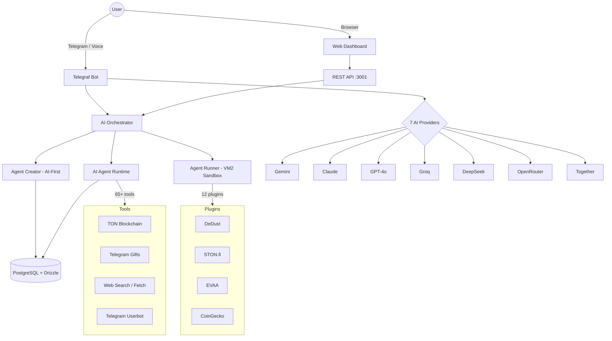
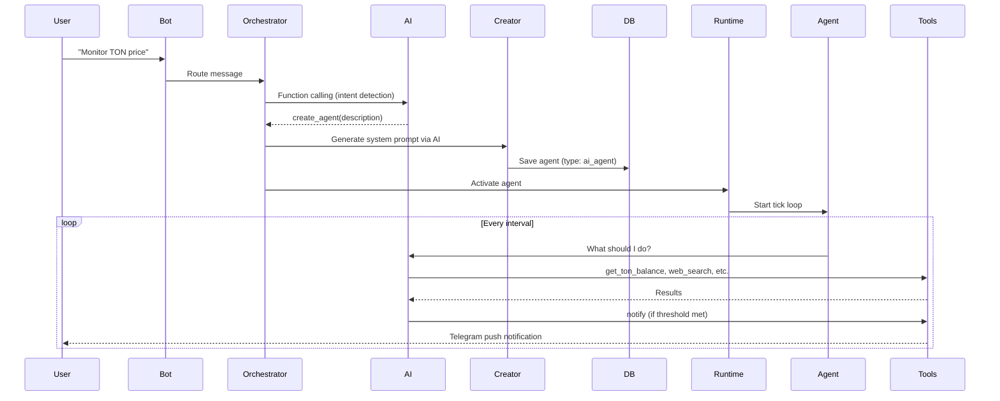

# Architecture

TON Agent Platform is a monorepo with two apps and shared packages, designed for building and running autonomous AI agents on the TON blockchain.

## Repository Structure

```
ton-agent-platform/
  apps/
    builder-bot/       # Telegraf bot + REST API (main application)
    landing/           # Web dashboard (dashboard.html, dashboard.js, dashboard.css)
  packages/            # Shared packages
  infrastructure/      # Docker Compose, nginx configs
```

## System Overview



## Core Components

### Orchestrator (`src/agents/orchestrator.ts`)
Central brain of the platform. Routes user messages via AI function calling:
- Intent detection (create agent, chat, NFT analysis, wallet ops, etc.)
- Agent CRUD operations
- Multi-provider AI (7 providers + platform proxy fallback)
- Context-aware responses (knows current dashboard page)

### AI Agent Runtime (`src/agents/ai-agent-runtime.ts`)
Autonomous agent execution engine:
- Agentic loop: AI calls tools iteratively (up to 5 per tick)
- 65+ tools: TON, NFT, gifts, web search, Telegram userbot, DeFi
- Safety rules: transaction limits, scraping rate limits
- MCP integration: per-agent TON MCP subprocess
- VM2 sandbox for flow code execution

### REST API Server (`src/api-server.ts`)
HTTP API for the Web Dashboard (42 endpoints):
- Telegram OAuth + deeplink authentication
- Agent management, chat, marketplace, wallet
- Rate limiting per user/IP
- CORS with strict origin allowlist

### Bot (`src/bot.ts`)
Telegraf v4 bot for the Telegram interface:
- Command handlers (/start, /agents, /wallet, /marketplace, etc.)
- 50+ callback query handlers
- Voice command transcription (Gemini multimodal or Whisper)
- State machines for multi-step flows (creation, rename, publish, auth)
- MarkdownV2 safe reply with plain-text fallback

### Database
PostgreSQL 15 with Drizzle ORM:
- Users, agents, executions, logs, marketplace listings
- Agent state persisted (write-through cache, survives restarts)
- User variables for global API keys

## Data Flow: Agent Creation



## Multi-Provider AI

| Provider | Default Model | Key Prefix |
|----------|--------------|------------|
| Gemini | gemini-2.5-flash | AIzaSy... |
| Anthropic | claude-haiku-4-5 | sk-ant-... |
| OpenAI | gpt-4o-mini | sk-proj-... |
| Groq | llama-3.3-70b-versatile | gsk_... |
| DeepSeek | deepseek-chat | sk-... |
| OpenRouter | google/gemini-2.5-flash | sk-or-... |
| Together | Llama-3.3-70B-Instruct-Turbo | — |

All providers use the OpenAI-compatible API format. If the user has no API key, the platform proxy provides AI automatically.

## TON Integration

| Layer | Technology | Usage |
|-------|-----------|-------|
| Wallet | @ton/core, @ton/ton, @ton/crypto | Key derivation, message signing |
| API | TonAPI v2 (tonapi.io) | Balances, NFTs, transactions, DNS |
| DeFi | DeDust API, STON.fi API | Swap simulation, pool data, prices |
| Connect | @tonconnect/sdk | User wallet connection (Tonkeeper) |
| MCP | @ton/mcp | Dynamic tool discovery per agent |
| Gifts | Bot API + GramJS MTProto + GiftAsset + SwiftGifts | Catalog, purchases, arbitrage |

## Security Architecture

- **VM2 sandbox** — all dynamic code runs in isolated VM, no fs/child_process/net
- **SSRF protection** — blocked internal IPs, metadata endpoints, dangerous protocols
- **Rate limiting** — per-user/IP on all critical endpoints
- **Transaction limits** — max 100 TON per autonomous transfer
- **AI safety rules** — injected into every agent system prompt
- **Input validation** — message length limits, type checks on all endpoints
- **Auth** — Telegram OAuth + deeplink auth; no passwords stored
- **Fetch timeouts** — 10s AbortSignal on all external HTTP calls
