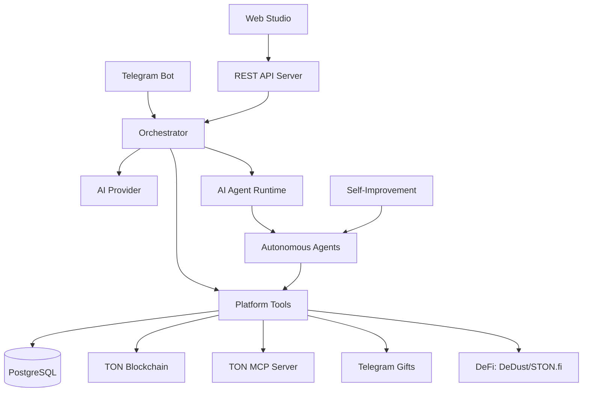
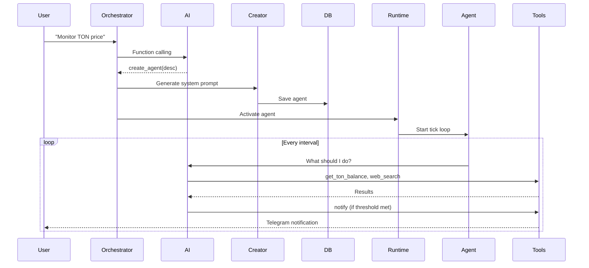

# Architecture

## System Overview

## Core Components

### Orchestrator (`src/agents/orchestrator.ts`)
Central brain of the platform. Routes user messages to appropriate tools:
- Intent detection via AI function calling
- Agent CRUD operations
- Multi-provider AI (7 providers + fallback)
- Context-aware responses (knows current Studio page)

### AI Agent Runtime (`src/agents/ai-agent-runtime.ts`)
Autonomous agent execution engine:
- Agentic loop: AI calls tools iteratively (up to 5 per tick)
- 65+ tools: TON, NFT, gifts, web, Telegram, DeFi
- Safety rules: transaction limits, scraping rate limits
- MCP integration: per-agent TON MCP subprocess
- VM2 sandbox for flow code execution

### REST API Server (`src/api-server.ts`)
HTTP API for Web Studio:
- Telegram OAuth authentication
- Agent management endpoints (42 routes)
- Rate limiting per user/IP
- CORS with HTTPS enforcement
- Input validation on all endpoints

### Bot (`src/bot.ts`)
Telegraf v4 bot for Telegram interface:
- Command handlers (/start, /agents, /wallet, etc.)
- Callback query routing (50+ handlers)
- Voice command transcription
- State machines for multi-step flows
- Pending Map cleanup with TTL

## Data Flow

## TON Integration Map

| Layer | Technology | Usage |
|-------|-----------|-------|
| Wallet | @ton/core, @ton/ton, @ton/crypto | Key derivation, message signing, BOC |
| API | TonAPI v2 (tonapi.io) | Balances, NFTs, transactions, DNS |
| DeFi | DeDust API, STON.fi API | Swap simulation, pool data, prices |
| Connect | @tonconnect/sdk | User wallet connection (Tonkeeper) |
| MCP | @ton/mcp | Dynamic tool discovery per agent |
| Gifts | Telegram Bot API + GramJS MTProto | Gift catalog, purchases, arbitrage |

## Security Architecture

- **No eval()** — safe expression evaluator for workflows
- **VM2 sandbox** — all dynamic code runs in isolated VM
- **SSRF protection** — blocked internal IPs, metadata endpoints
- **Rate limiting** — per-user/IP on all critical endpoints
- **Transaction limits** — max 100 TON per autonomous transfer
- **AI safety rules** — injected into every agent's system prompt
- **Input validation** — message length limits, type checks
- **Session management** — 24h TTL, periodic cleanup
